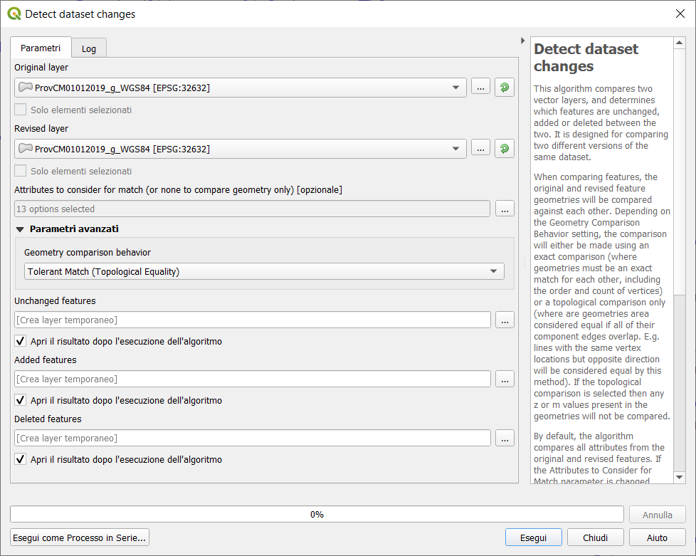
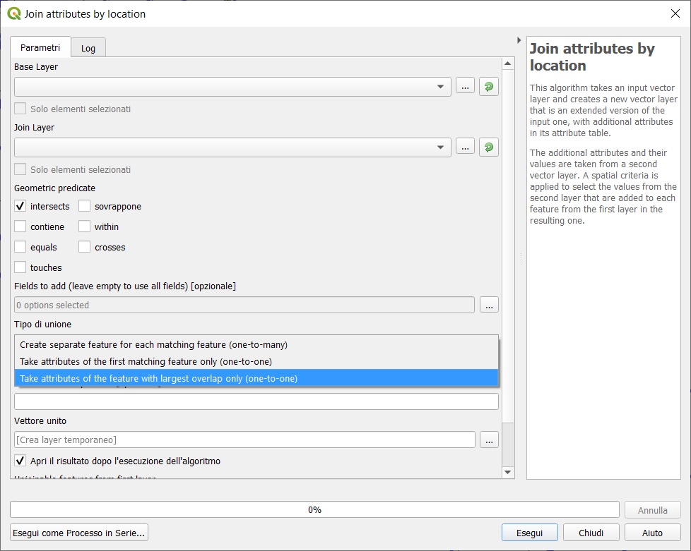
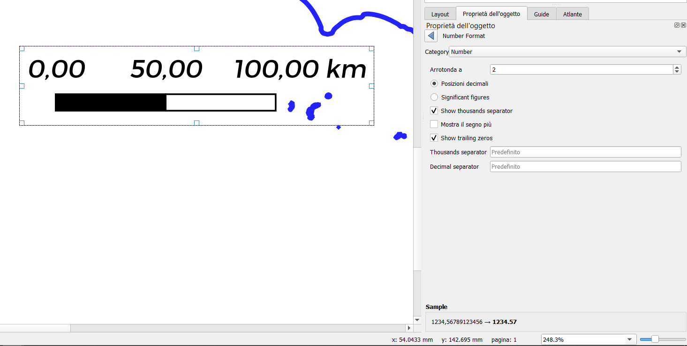
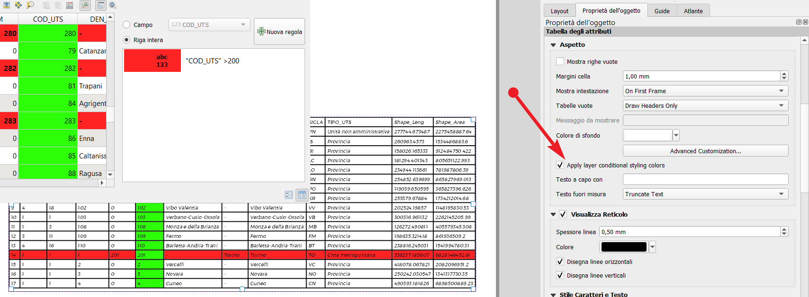
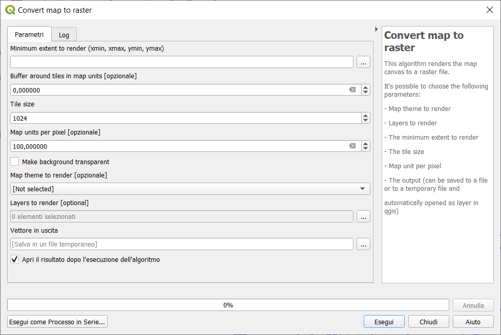
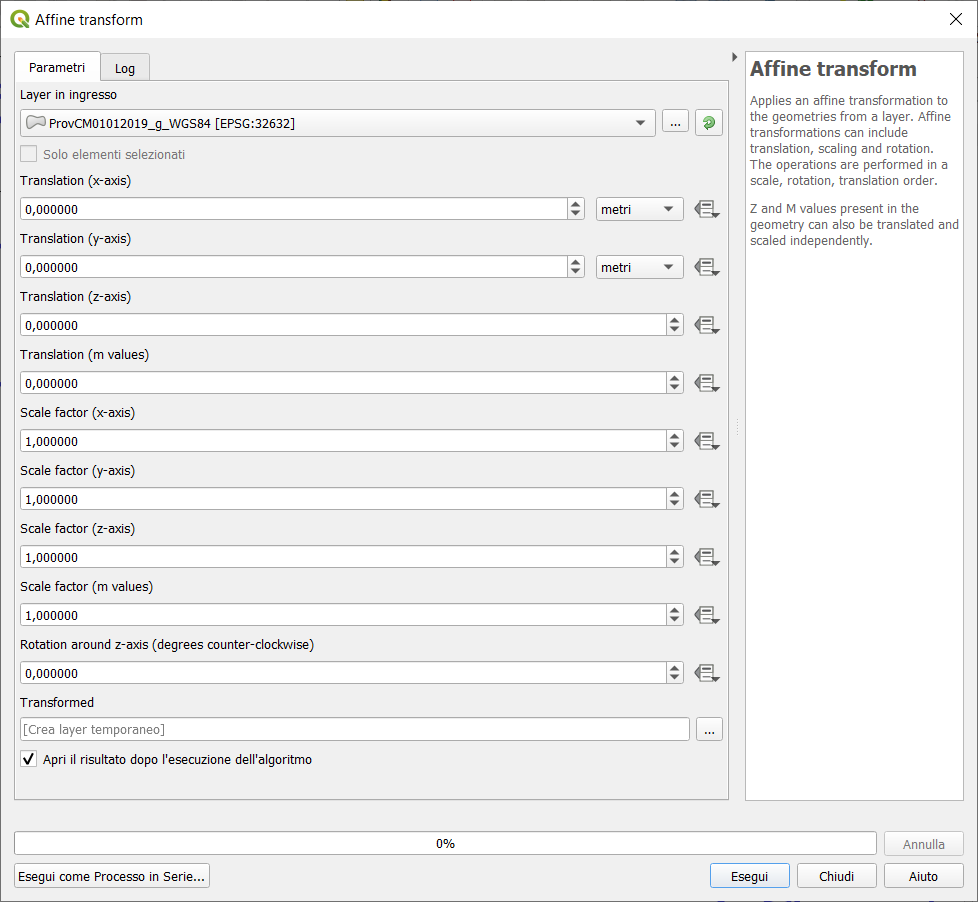
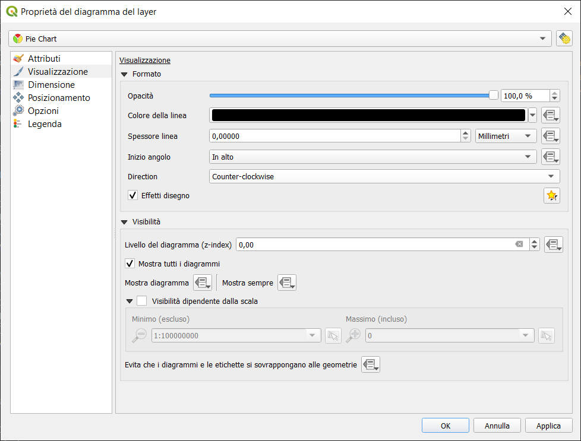
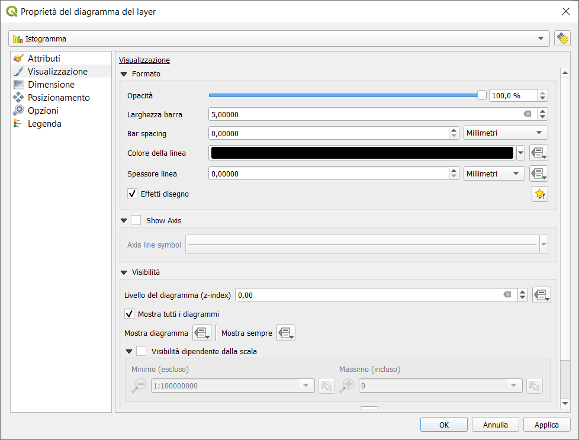
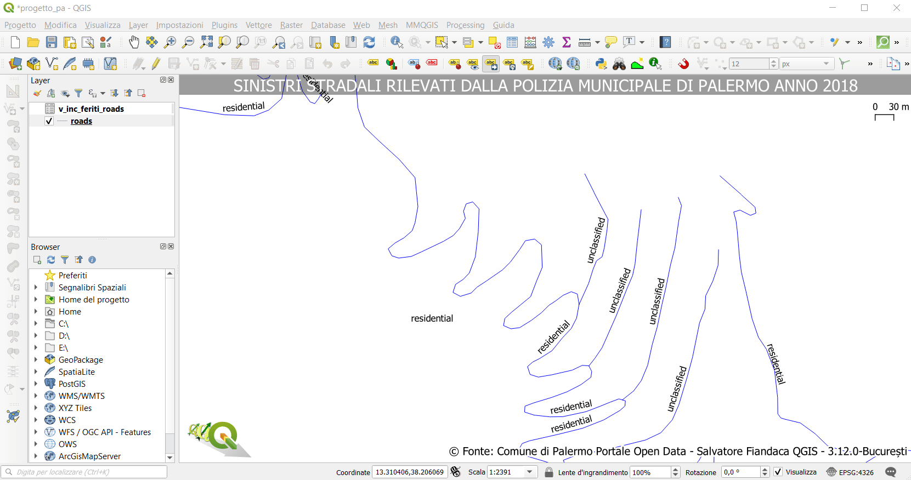
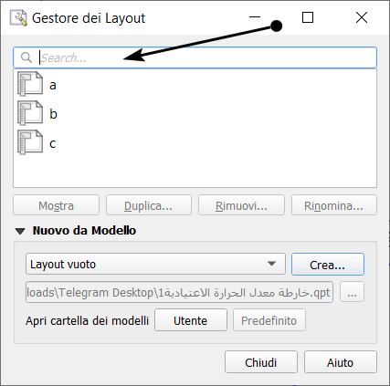

# Changelog312

The following changelogs are the result of this filter:

```
is:pr is:closed label:feature merged:2019-10-25T00:00:00Z..2020-02-21T00:00:00Z
```

Changelog 3.12 București - Release date: 21 February, 2020


---

##	QGIS Development Server Application
- **author**:	[elpaso](https://twitter.com/elpaso66)
- **merged**:	2020-01-24T17:56:37Z
- **tags**:	Feature;Needs Documentation;Server 
- ([REVERT](https://github.com/qgis/QGIS/pull/34124))
- **PR**:	[33921](https://github.com/qgis/QGIS/pull/33921)

##	MBTiles raster support in WMS provider
- **author**:	[wonder-sk](https://github.com/wonder-sk)
- **milestone**:	3.12.0
- **merged**:	2020-01-17T13:18:41Z
- **tags**:	Changelog;Feature
- **PR**:	[33855](https://github.com/qgis/QGIS/pull/33855)
- **Description**:  This PR adds MBTiles tiled raster map support to WMS provider so that it uses the same code paths
like WMTS or XYZ tiles.

##	Add new algorithm: Detect Dataset Changes
- **author**:	[nyalldawson](https://twitter.com/nyalldawson)
- **milestone**:	3.12.0
- **merged**:	2020-01-16T06:35:51Z
- **tags**:	Feature;Processing
- **PR**:	[33832](https://github.com/qgis/QGIS/pull/33832)
- **Description**:  This algorithm compares two vector layers, and determines which features
are unchanged, added or deleted between the two. It is designed for comparing
two different versions of the same dataset.



##	New algorithm "Rename table field"
- **author**:	[nyalldawson](https://twitter.com/nyalldawson)
- **milestone**:	3.12.0
- **merged**:	2020-01-15T08:56:11Z
- **tags**:	Changelog;Feature;Processing
- **PR**:	[33807](https://github.com/qgis/QGIS/pull/33807)
- **Description**:  Takes an input layer, existing field and a new name for the field, and
outputs a new layer with the selected field renamed.


##	Show distance from GPS lock position to current cursor
- **author**:	[nyalldawson](https://twitter.com/nyalldawson)
- **milestone**:	3.12.0
- **merged**:	2020-01-15T08:55:28Z
- **tags**:	Feature;GPS
- **PR**:	[33780](https://github.com/qgis/QGIS/pull/33780)
- **Description**:  When a GPS device is connected, whenever the user moves the cursor over the canvas a live status bar message displays the distance and bearing from the cursor to the GPS fix position.


##	Add new mode to "Join Attributes by Location" to take attributes from matching feature with largest area of overlap only
- **author**:	[nyalldawson](https://twitter.com/nyalldawson)
- **milestone**:	3.12.0
- **merged**:	2020-01-14T08:28:32Z
- **tags**:	Changelog;Feature;Processing
- **PR**:	[33754](https://github.com/qgis/QGIS/pull/33754)
- **Description**:  This allows for easy polygon->polygon joins, where you expect there to be
only a single matching feature and don't want to include features which
are just touching or have just tiny sliver polygon overlaps.
- **Sponsored by** SMEC/SJ
  


##	New layout item type: manually created fixed tables
- **author**:	[nyalldawson](https://twitter.com/nyalldawson)
- **milestone**:	3.12.0
- **merged**:	2020-01-14T06:08:21Z
- **tags**:	Feature;Print Layouts
- **PR**:	[33734](https://github.com/qgis/QGIS/pull/33734)
- **Description**:  This new item type allows for creation of tables with contents manually entered by users (i.e. spreadsheet style), so that users can create completely custom tables. Supports control custom cell contents, foreground and background colors (and soon, preset row and column heights).
- **Sponsored by** City of Canning


##	Fix invalid attributes dialog on copy to another layer
- **author**:	signedav
- **milestone**:	3.12.0
- **merged**:	2020-01-15T07:00:43Z
- **tags**:	Feature;Needs Documentation
- **PR**:	[33688](https://github.com/qgis/QGIS/pull/33688)
- **Description**:  It's possible to copy features from one layer to another.
If there are the same fields in the destination layer, then the attributes for them are taken from the original feature. If not, the default value is taken. Otherwise the new attribute is null. If the destination layer has constraints on the fields, these should be fulfilled now or disregarded on purpose. But not just copied invalid like it used to do.


##	Native PostGIS raster data provider
- **author**:	[elpaso](https://twitter.com/elpaso66)
- **milestone**:	3.12.0
- **merged**:	2020-01-17T10:31:28Z
- **PR**:	[33685](https://github.com/qgis/QGIS/pull/33685)
- **Description**:  This is an implementation of a PostGIS raster data provider in QGIS core. Tiles are cached in RAM memory.
- **Sponsored by** Christmas Holidays Inc.

##	Allow customization of the items shown in browser
- **author**:	[PeterPetrik](https://github.com/PeterPetrik)
- **milestone**:	3.12.0
- **merged**:	2020-01-15T09:08:59Z
- **PR**:	[33679](https://github.com/qgis/QGIS/pull/33679)
- **Description**:  Allow customization of the items shown in browser. User can decide (in the Interface Customization dialog) to hide some of the root items in the browser panel (e.g. Favourites, or POSTGIS provider, ...)
- **Sponsored by** Limerick City and County Council


##	Add setting for format to show angular bearings to projects
- **author**:	[nyalldawson](https://twitter.com/nyalldawson)
- **merged**:	2020-01-09T04:10:31Z
- **tags**:	Feature;Needs Documentation
- **PR**:	[33674](https://github.com/qgis/QGIS/pull/33674)
- **Description**:  The Settings - Options - Map Tools tab contains a new setting for controlling the default format to use for displaying angular bearings for newly created projects. Whenever a new project is created, it will
inherit this default settings. The Project Properties dialog also has a new setting for the project-specific bearing format. The intention is that whenever angular bearings are shown in QGIS, they will be formatted using the current project's bearing format settings. In this PR I've done this for the status bar pan direction message. Also includes lots of nice API additions providing a stable, easy to discover place to set and retrieve settings like the bearing format.


##	Add user control over scalebar numeric formats
- **author**:	[nyalldawson](https://twitter.com/nyalldawson)
- **merged**:	2020-01-09T06:51:51Z
- **tags**:	Changelog;Feature;Needs Documentation;Print Layouts
- **PR**:	[33657](https://github.com/qgis/QGIS/pull/33657)
- **Description**:  Amongst other follow ups to the recent numeric format API support, this exposes the option for controlling the numeric format used by a layout scalebar. It gives users control over all the formatting properties for the numbers in scalebars, including whether they want thousand separators, decimal places, scientific notation, etc. Very useful in the case of making maps for audiences outside of the current QGIS locale, or when you'd just prefer to vary the style from the locale defaults (e.g. adding thousands separators when the locale default is to hide them).



##	Add Refresh action to OGC services
- **author**:	Samweli
- **milestone**:	3.12.0
- **merged**:	2020-01-18T02:18:21Z
- **PR**:	[33651](https://github.com/qgis/QGIS/pull/33651)
- **Description**:  This PR adds refresh action to OGC Services and also fixes [#33621](https://github.com/qgis/QGIS/issues/33621). For the [#33621](https://github.com/qgis/QGIS/issues/33621), I have override the WMSLayerItem [equal](https://github.com/Samweli/QGIS/blob/5b8759c5cd126b1da11996e19a706beff6d28ba3/src/providers/wms/qgswmsdataitems.h#L81) function from QgsLayerItem, to provide a further layer properties comparison ( leaving out path and name only comparison ), might need others efforts to increase the function layer properties coverage. I have also added a new class [QgsWMSLayerCollectionItem](https://github.com/Samweli/QGIS/blob/5b8759c5cd126b1da11996e19a706beff6d28ba3/src/providers/wms/qgswmsdataitems.h#L49) to handle the WMS Layers which enclose other layers. So we can handle them separately. I found it tricky to fix them especially in the #33621 case.


##	Allow layout attribute tables to be styled using the foreground and background colors of matching conditional styles
- **author**:	[nyalldawson](https://twitter.com/nyalldawson)
- **milestone**:	3.12.0
- **merged**:	2020-01-08T02:31:25Z
- **tags**:	Changelog;Feature;Needs Documentation;Print Layouts
- **PR**:	[33638](https://github.com/qgis/QGIS/pull/33638)
- **Description**:  When the new "Apply layer conditional styling colors" option is enabled in the layout attribute table settings, any conditional styling rules present in the layer will be applied inside the layout attribute table (foreground and background colors only, for now!). Refs [#25712](https://github.com/qgis/QGIS/issues/25712)



##	Support for Oracle curves and surfaces
- **author**:	troopa81
- **milestone**:	3.12.0
- **merged**:	2020-01-13T00:24:26Z
- **tags**:	Changelog;Data Provider;Feature
- **PR**:	[33629](https://github.com/qgis/QGIS/pull/33629)
- **Description**:  This PR adds edition support for Oracle following geometry type:

      * CircularString(Z)
      * CompoundCurve(Z)
      * MultiCurve(Z)
      * CurvePolygon(Z)
      * MultiSurface(Z)

##	New parameter type for map themes
- **author**:	[nyalldawson](https://twitter.com/nyalldawson)
- **merged**:	2020-01-05T10:50:06Z
- **tags**:	Feature;Processing
- **PR**:	[33608](https://github.com/qgis/QGIS/pull/33608)
- **Description**:  Fixes an api break in the rasterize algorithm, and then adds a proper dedicated parameter type for map theme selection



##	Rotate expression function (with followups)
- **author**:	[nyalldawson](https://twitter.com/nyalldawson) [raymondnijssen](https://github.com/raymondnijssen)
- **merged**:	2020-01-02T04:45:07Z
- **tags**:	Changelog;Feature
- **PR**:	[33575](https://github.com/qgis/QGIS/pull/33575)
- **Description**:  rotate() expression function [#33125](https://github.com/qgis/QGIS/pull/33125)


##	Add native affine transform algorithm for vectors
- **author**:	[nyalldawson](https://twitter.com/nyalldawson)
- **merged**:	2019-12-31T05:01:36Z
- **tags**:	Changelog;Feature;Processing
- **PR**:	[33552](https://github.com/qgis/QGIS/pull/33552)
- **Description**: Offers the following benefits over the GRASS/SAGA versions:
  * Full support for z/m values and handling curved geometries without loss
  * of curves
  * Works with all native data types, no need for format transformation
  * Supports dynamic (data defined, per feature) translate/scale/rotate parameters
  * Allows transformation and scaling of both Z and M values (if present)
  * Supports in-place edit mode
  
* Fixes [#33550](https://github.com/qgis/QGIS/issues/33550)



##	Allow dropping a map layer from the layer tree onto a projection selection widget
- **author**:	[nyalldawson](https://twitter.com/nyalldawson)
- **merged**:	2019-12-22T19:17:41Z
- **tags**:	Changelog;Feature;GUI/UX
- **PR**:	[33485](https://github.com/qgis/QGIS/pull/33485)
- **Description**:  ...to set the projection to match that layer. Just a little timesaving shortcut!


##	Load 3D vector layer data in background + tiling
- **author**:	[wonder-sk](https://github.com/wonder-sk)
- **milestone**:	3.12.0
- **merged**:	2020-01-16T23:00:34Z
- **tags**:	3D;Changelog;Feature
- **PR**:	[33480](https://github.com/qgis/QGIS/pull/33480)
- **Description**:  This adds support for background loading of data from vector layers into 3D map views. Until now, loading (and tessellation) would freeze the GUI completely - this could take many seconds depending on the complexity of input data.
- **Sponsored by** QGIS.org grant.

##	Stored expressions
- **author**:	[elpaso](https://twitter.com/elpaso66)
- **milestone**:	3.12.0
- **merged**:	2019-12-17T19:13:33Z
- **tags**:	Expressions;Feature
- **PR**:	[33437](https://github.com/qgis/QGIS/pull/33437)
- **Description**:  Store user expressions (with context/category, just like recent expressions);Clear editor icon/action
- **Sponsored by** [Salvatore Fiandaca (aka Pigreco)](https://pigrecoinfinito.com/2019/12/15/shortest-ever-crowdfunding/), This PR implements part of QEP [qgis/QGIS-Enhancement-Proposals#135](https://github.com/qgis/QGIS-Enhancement-Proposals/issues/135)


##	List referenced layer values in Expression Builder
- **author**:	signedav
- **merged**:	2019-12-20T16:29:11Z
- **PR**:	[33436](https://github.com/qgis/QGIS/pull/33436)
- **Description**:  When a field is a RelationReference, ValueRelation and ValueMap, there is the possibility not only to show the values of the current layer but also the possible values in the referenced layer / configured possiblities. age is a ValueMap, species is a ValueRelation and island_id is a RelationReference


##	Other average methods 3d mesh
- **author**:	[PeterPetrik](https://github.com/PeterPetrik)
- **milestone**:	3.12.0
- **merged**:	2019-12-20T06:48:40Z
- **tags**:	Feature;Mesh;Needs Documentation
- **PR**:	[33426](https://github.com/qgis/QGIS/pull/33426)
- **Description**:   add all remaining method based on [qgis/QGIS-Enhancement-Proposals#158](https://github.com/qgis/QGIS-Enhancement-Proposals/issues/158), for methods description see <https://fvwiki.tuflow.com/index.php?title=Depth_Averaging_Results>


##	Fixes time reference for mesh layer #32186 #33399 #31933
- **author**:	vcloarec
- **milestone**:	3.12.0
- **merged**:	2019-12-17T13:56:50Z
- **tags**:	Bug;Data Provider;Feature;Mesh
- **PR**:	[33410](https://github.com/qgis/QGIS/pull/33410)
- **Description**:  fixes [#32186](https://github.com/qgis/QGIS/issues/32186) [#33399](https://github.com/qgis/QGIS/issues/33399) [#31933](https://github.com/qgis/QGIS/issues/31933)
since [`6e2ef15`](https://github.com/qgis/QGIS/commit/6e2ef1544f14c7a5f700447825780f5d93c3c927), MDAL provide time reference for dataset.
This PR allows QGis to read this time reference for mesh layer
If there is a valid time reference provided with dataset groups, this time reference is used to displaying time (using absolute time).
If there is no reference time provided, the time is displayed using relative time, and a time reference can be set by the user to display absolute time.
When no time reference is provided, default one is current date + time set with 00:00:00.
A push button is added to reload the reference time provided with dataset groups, if needed.Also adds a new feature to let the user set the time unit of the provider with a combo box if thise time unit is different than hours.


##	Add expressions is_empty(geom)  is_empty_or_null(geom)
- **author**:	[lbartoletti](https://twitter.com/lo_bartoletti)
- **merged**:	2019-12-16T07:06:59Z
- **PR**:	[33333](https://github.com/qgis/QGIS/pull/33333)
- **Description**:  Following my work on empty geometries, here is a new expression to catch them.


##	Support datasets with data defined on faces in mesh calculator
- **author**:	[PeterPetrik](https://github.com/PeterPetrik)
- **milestone**:	3.12.0
- **merged**:	2019-12-06T17:27:29Z
- **tags**:	Feature;Mesh
- **PR**:	[33248](https://github.com/qgis/QGIS/pull/33248)
- **Description**:  fix [#30219](https://github.com/qgis/QGIS/issues/30219) fix [#30170](https://github.com/qgis/QGIS/issues/30170) added "driver" and "group name" to the calculator interface. MDAL now supports 3 drivers for storing results, so user must be able to choose appropriate driver and dataset group name (some drivers store multiple groups to 1 file)


##	Show the total pan distance and bearing in the status bar
- **author**:	[nyalldawson](https://twitter.com/nyalldawson)
- **merged**:	2019-12-05T18:50:19Z
- **PR**:	[33241](https://github.com/qgis/QGIS/pull/33241)
- **Description**: ...during canvas pan operations. Allows users to know exactly how far (and in what direction) they've dragged the map.


##	Add option to auto-rotate canvas to GPS bearing; show GPS bearing as a line over map
- **author**:	[nyalldawson](https://twitter.com/nyalldawson)
- **merged**:	2019-12-10T03:05:06Z
- **tags**:	Feature;GPS
- **PR**:	[33240](https://github.com/qgis/QGIS/pull/33240)
- **Description**:  
  * _**Add option to auto-rotate canvas to GPS bearing**_: When enabled, the map canvas will automatically rotate so that it's oriented in the same direction as the GPS bearing;
  * _**Show GPS bearing as a line over map**_: Allow showings a bearing line from the GPS location pointed in the GPS's direction. Allows users to view a "current path" directional line as they navigate using a GPS

##	Show html files in browser panel
- **author**:	[nyalldawson](https://twitter.com/nyalldawson)
- **merged**:	2019-12-06T04:39:10Z
- **PR**:	[33219](https://github.com/qgis/QGIS/pull/33219)
- **Description**:  Allows .htm(l) files to be shown and opened from the browser panel. These are often used to document data files or mapping projects.


##	New algorithm "Repair Shapefile"
- **author**:	[nyalldawson](https://twitter.com/nyalldawson)
- **merged**:	2019-12-04T09:58:03Z
- **tags**:	Feature;Processing
- **PR**:	[33218](https://github.com/qgis/QGIS/pull/33218)
- **Description**:  Uses GDAL to repair shapefiles which have a broken or missing .SHX file.


##	Static particle traces for rendering mesh vector dataset
- **author**:	vcloarec
- **milestone**:	3.12.0
- **merged**:	2019-12-03T07:13:37Z
- **tags**:	Feature;Mesh
- **PR**:	[33165](https://github.com/qgis/QGIS/pull/33165)
- **Description**:  This PR permits to display directly in QGIS static particle traces for vector datasets in mesh layer without any plugin.
The user can choose in the mesh layer properties window :
  * the color
  * the size of the traces (line width)
  * the count of particles
  * the maximum length of the particle's tail


##	Stacked 3d mesh (part 1.)
- **author**:	[PeterPetrik](https://github.com/PeterPetrik)
- **milestone**:	3.12.0
- **merged**:	2019-12-05T06:08:52Z
- **tags**:	Data Provider;Feature;Mesh;Squash!
- **PR**:	[33153](https://github.com/qgis/QGIS/pull/33153)
- **Description**:  initial implementation of QEP 158, please see QEP for description; [qgis/QGIS-Enhancement-Proposals#158](https://github.com/qgis/QGIS-Enhancement-Proposals/issues/158)


##	Show "Open Document..." action when right clicking certain
- **author**:	[nyalldawson](https://twitter.com/nyalldawson)
- **merged**:	2019-12-04T06:50:53Z
- **PR**:	[33142](https://github.com/qgis/QGIS/pull/33142)
- **Description**:  files in the browser, allowing them to be opened with the default application for that file type; E.g. PDFs will open with the default PDF viewer.
Works with PDF, ODS, XLS(X), CSV, TXT, PNG, JPEG, TIFF, SVG (other types will likely need more work, since they aren't currently shown in the browser)


##	Allow drag and drop of pictures onto layouts
- **author**:	[nyalldawson](https://twitter.com/nyalldawson)
- **merged**:	2019-11-28T08:38:32Z
- **tags**:	Feature;Print Layouts
- **PR**:	[33113](https://github.com/qgis/QGIS/pull/33113)
- **Description**:  E.g. drag an svg from a file explorer onto the layout to create a new picture item containing that svg image.


##	Paint effect support for diagram renderer
- **author**:	[nyalldawson](https://twitter.com/nyalldawson)
- **merged**:	2019-11-24T20:20:44Z
- **PR**:	[33044](https://github.com/qgis/QGIS/pull/33044)
- **Description**:  Allows for diagrams to use paint effects, including drop shadows, outer glows, etc...
- **Sponsored by** SLYR

##	New diagram type "stacked bars"
- **author**:	[nyalldawson](https://twitter.com/nyalldawson)
- **merged**:	2019-11-24T09:11:22Z
- **PR**:	[33043](https://github.com/qgis/QGIS/pull/33043)
- **Description**:  Stacks bars of varying colors for each attribute on top of each other vertically or horizontally. Designed to match the "Stacked" chart renderer option available in ArcGIS.
- **Sponsored by** SLYR


##	Diagrams - add option to show axis for histogram plots; many fixes
- **author**:	[nyalldawson](https://twitter.com/nyalldawson)
- **merged**:	2019-11-23T08:06:19Z
- **PR**:	[33029](https://github.com/qgis/QGIS/pull/33029)
- **Description**:  (The fixes will be manually backported) This adds the option to show the histogram axis for histogram diagram types.
- **Sponsored by** SLYR


##	Streamlines Renderer for vector dataset on mesh layer.
- **author**:	vcloarec
- **milestone**:	3.12.0
- **merged**:	2019-11-25T07:54:12Z
- **tags**:	Feature;Mesh
- **PR**:	[32996](https://github.com/qgis/QGIS/pull/32996)
- **Description**:  ixes #29534 - The vector dataset of a mesh layer is currently only rendered with arrows. This PR adds a new feature to render vectors field with streamlines. The streamlines are seeded with a start point. The seeding can be done from the vertices of the mesh, from a user grid or randomly. The user chooses a method in a combo box: On Mesh/grid or Randomly. With the option On Mesh/Grid, by default, the vertices of the mesh are used to start the streamlines, but the user can define a grid (as for arrows) by entering spacing (px). An alternative is to choose Randomly. The start points are defined randomly and the user can then define a density that represents the part of pixels occupied by streamlines in the extent of the mesh displayed on the screen.


##	Add option to control pie diagram angular direction
- **author**:	[nyalldawson](https://twitter.com/nyalldawson)
- **merged**:	2019-11-21T23:01:51Z
- **PR**:	[32986](https://github.com/qgis/QGIS/pull/32986)
- **Description**:  I.e. control whether the sections are rendered in a clockwise or anticlockwise direction
- **Sponsored by** SLYR



##	Add spacing option for vector layer bar chart diagrams
- **author**:	[nyalldawson](https://twitter.com/nyalldawson)
- **merged**:	2019-11-21T05:21:45Z
- **PR**:	[32984](https://github.com/qgis/QGIS/pull/32984)
- **Description**:  Allows for user-controlled spacing between each bar in the chart.
- **Sponsored by** SLYR



##	Allow to delete custom label position
- **author**:	3nids
- **merged**:	2019-11-20T10:46:22Z
- **tags**:	Feature;Labeling
- **PR**:	[32942](https://github.com/qgis/QGIS/pull/32942)
- **Description**:  by pressing DEL key when moving the label.



##	Add search box to layout manager
- **author**:	[nyalldawson](https://twitter.com/nyalldawson)
- **milestone**:	3.12.0
- **merged**:	2019-11-20T07:38:29Z
- **PR**:	[32939](https://github.com/qgis/QGIS/pull/32939)
- **Description**:  Allows filtering the list of layouts in a project by name, handy when a project has many layouts..!



##	is_valid expression
- **author**:	pkinglinz
- **merged**:	2019-11-17T16:31:49Z
- **tags**:	Expressions;Feature
- **PR**:	[32900](https://github.com/qgis/QGIS/pull/32900)
- **Description**:  Add an is_valid function to the expressions, which reuses GEOS is valid and returns true if a geometry is valid; if it is well-formed in 2D according to the OGC rules. Based of @NathanW2 workshop at FOSS4g Oceania.
I have tested the function manually and confirmed the tests pass, however I can't get my build to produce the help files to check if this or correct. I"m not sure if "Uses GEOS" is needed in the help file.


##	Processing raster calc: add missing btns and validate
- **author**:	[elpaso](https://twitter.com/elpaso66)
- **merged**:	2019-11-16T07:19:28Z
- **tags**:	Feature;GUI/UX;Processing
- **PR**:	[32890](https://github.com/qgis/QGIS/pull/32890)
- **Description**:  Add missing buttons for ABS/MIN/MAX and validate expression.


##	Make the DXF renderer ready for background threading and fix symbology
- **author**:	[m-kuhn](https://twitter.com/_mkuhn)
- **merged**:	2019-11-14T08:47:23Z
- **PR**:	[32770](https://github.com/qgis/QGIS/pull/32770)
- **Description**:  This puts the whole dxf export into one single rendering process and prefetches information related to this before starting to render. The immediate benefit is to fix symbology. The current code writes symbol blocks for symbol layers (e.g. for dashed lines), when the lines are actually rendered, they don't reference the block. This was caused by the fact that rendering was restarted for writing blocks and for writing entities. With the result that different clones of the symbol layers were used and therefore could not be matched. The advantage in the longer run is that we will be able to run dxf exports in the background (allow to cancel, processing algorithms, ...) because they no longer rely on the QgsVectorLayer objects but rather on feature source and other threading friendly facilities.

##	Add Fuzzy Logic raster algorithms
- **author**:	root676
- **merged**:	2019-11-10T19:26:03Z
- **tags**:	Feature;Processing
- **PR**:	[32701](https://github.com/qgis/QGIS/pull/32701)
- **Description**:  his PR proposes six new processing algorithms from the domain of fuzzy logic raster analysis, a method commonly used in site analysis. The proposed Fuzzify raster algorithms transform an input raster to a fuzzified raster and thereby assigns values between 0 (no membership) and 1 (full membership) following a fuzzy membership function. Each function is implemented in a separate algorithm due to varying number and type of parameter functions and inplement a base class in order to avoid code duplication. Currently, the functions implement

  * **Linear** fuzzy membership
  * **Power** fuzzy membership
  * **Large** fuzzy membership
  * **Small** fuzzy membership
  * **Gaussian** fuzzy membership
  * **Near** fuzzy membership

Example graphs are provided below. The equations are all sourced from Kritikos, T., et al. (2014). They are also available in the ArcGIS 10.x Spatial Analyst algorithm 'Fuzzy Membership' and now become available for open source GIS for the first time. The algorithm names are orientated after the functions provided by ESRI algorithms in order to make access and usage for proprietory GIS users easier.


Output fuzzified layer showcasing location suitability for a certain kind of crop by applying a linear fuzzy membership function:


##	Server OAPIF simple transactions
- **author**:	[elpaso](https://twitter.com/elpaso66)
- **milestone**:	3.12.0
- **merged**:	2019-11-15T13:21:04Z
- **tags**:	Feature;Server
- **PR**:	[32694](https://github.com/qgis/QGIS/pull/32694)
- **Description**:  Simple OAPIF server transactions : Preliminary specs:
<https://github.com/opengeospatial/ogcapi-features/blob/master/extensions/transactions/TX_Notes.adoc>

##	Server OAPIF properties
- **author**:	[elpaso](https://twitter.com/elpaso66)
- **merged**:	2019-11-06T09:48:05Z
- **tags**:	Feature;Server
- **PR**:	[32655](https://github.com/qgis/QGIS/pull/32655)
-  **Description**:  Makes it possible to specify a comma separate list of attributes to be returned by items call. This is apparently not in core specifications but most of sample implementations supports it and well, it's just useful. Also adds nl2br utility function for templates.

##	HAlign/VAlign support for TEXT
- **author**:	[m-kuhn](https://twitter.com/_mkuhn)
- **merged**:	2019-11-07T15:37:07Z
- **tags**:	DXF/DWG;Feature
- **PR**:	[32629](https://github.com/qgis/QGIS/pull/32629)
- **Description**:  halign / valign support for dxf

##	Add save multiple styles action to style menu
- **author**:	[elpaso](https://twitter.com/elpaso66)
- **merged**:	2019-11-11T10:25:30Z
- **tags**:	Feature;GUI/UX
- **PR**:	[32628](https://github.com/qgis/QGIS/pull/32628)
- **Description**: Adds the possibility to save/export multiple styles at once in QML/SLD and in the DB, in case of file system export an incremental number is appended to the base file name i.e. export.qml, export_1.qml etc. in case of DBs the user can specify a new name for the exported syles, and in that case an incremental number is appended to the base style name i.e. name, name 1, name 2 etc., if the new name is left blank, the style name is used and in case of conflicts the incremental number is appended as well.


##	Add expression functions for converting to/from wkb
- **author**:	[nyalldawson](https://twitter.com/nyalldawson)
- **merged**:	2019-11-04T03:00:12Z
- **PR**:	[32561](https://github.com/qgis/QGIS/pull/32561)
- **Description**:  Adds geom_from_wkb and geom_to_wkb, which mirror the existing geom_from_wkt/geom_to_wkt functions but for WKB representations of geometries. 
Since QGIS 3.6 we've had good support for binary blob values in expressions and field values, so adding these functions allows users to work with binary blob fields containing WKB representations of geometries (e.g. with a geometry generator showing the encoded geometries)

|[](https://github.com/gbvitrano/HfcQGIS/blob/master/img/geometria/geom_from_wkb/geom_from_wkb1.png)

##	Add - **merged**:_from_epoch (MSec from epoch) expression function
- **author**:	rduivenvoorde
- **merged**:	2019-11-22T10:09:38Z
- **PR**:	[32551](https://github.com/qgis/QGIS/pull/32551)
- **Description**:  Adds a function to create a DateTime from a seconds since epoch timestamp, to be used in expresssions. As there is an 'epoch' function working in MilliSeconds (and the original Qt function also does MilliSeconds, I create it to use mSecs).


##	Ignored credentials temporary cache
- **author**:	[elpaso](https://twitter.com/elpaso66)
- **milestone**:	3.12.0
- **merged**:	2019-11-01T08:02:35Z
- **tags**:	Feature;GUI/UX
- **PR**:	[32546](https://github.com/qgis/QGIS/pull/32546)
- **Description**:  A new "Ignore" button is added to the dialog, with a tooltip explaining what it does.


##	Create child feature with geometry from the relation editor
- **author**:	troopa81
- **merged**:	2019-12-04T13:46:33Z
- **PR**:	[32528](https://github.com/qgis/QGIS/pull/32528)
- **Description**:  This PR allows to create a child feature by digitizing its geometry in the canvas directly from the relation editor widget.


##	Value relation restore missing layers from DBs
- **author**:	[elpaso](https://twitter.com/elpaso66)
- **milestone**:	3.12.0
- **merged**:	2019-11-04T11:03:41Z
- **tags**:	Feature;Requires Tests!
- **PR**:	[32487](https://github.com/qgis/QGIS/pull/32487)
- **Description**:  Checks for missing layers in value relation widget and loads them automatically (if possible), also warns the user if the layer could not be found.
- **Sponsored by** ARPA Piemonte

##	Selection widget in feature selection dialog
- **author**:	troopa81
- **merged**:	2019-12-16T10:32:26Z
- **PR**:	[32472](https://github.com/qgis/QGIS/pull/32472)
- **Description**:  This PR is the following of #31951 - it adds the feature selection widget  and  to the feature selection dialog and make it non modal.


##	add gdal_viewshed algorithm
- **author**:	alexbruy
- **merged**:	2019-11-06T03:40:35Z
- **tags**:	Feature;Processing
- **PR**:	[32463](https://github.com/qgis/QGIS/pull/32463)
- **Description**:  Expose new `gdal_viewshed` tool via Processing toolbox. Note: this requires **GDAL >= 3.1**.

##	Add density-based point count for the random marker fill
- **author**:	nirvn
- **merged**:	2019-10-30T05:04:14Z
- **tags**:	Feature;Symbology
- **PR**:	[32456](https://github.com/qgis/QGIS/pull/32456)
- **Description**:  This PR adds a density-based point count method to @nyalldawson 's brand new random marker fill.


##	Server wfs3 timefilter dimensions
- **author**:	[elpaso](https://twitter.com/elpaso66)
- **milestone**:	3.12.0
- **merged**:	2019-10-30T17:29:50Z
- **tags**:	Feature;Server
- **PR**:	[32322](https://github.com/qgis/QGIS/pull/32322)
- **Description**: Filters can be configured as Date or Time filters in WMS dimensions configuration (I need to work a bit on the GUI to make sure it is clear that Date and Time apply to OAPIF and WMS only accepts Time, but I need to check it).
- **Sponsored by** OSGeo

##	Add OGC API - Features (OAPIF) provider
- **author**:	[rouault](https://twitter.com/EvenRouault)
- **merged**:	2019-10-25T20:48:00Z
- **PR**:	[32262](https://github.com/qgis/QGIS/pull/32262)
- **Description**: Implements what was mentionned in <https://lists.osgeo.org/pipermail/qgis-developer/2019-September/058649.html>

##	Random marker fill symbol layer type
- **author**:	[nyalldawson](https://twitter.com/nyalldawson)
- **milestone**:	3.12.0
- **merged**:	2019-10-28T04:34:31Z
- **PR**:	[32241](https://github.com/qgis/QGIS/pull/32241)
- **Description**:  This commit adds a new fill symbol layer type "Random marker fill". It allows polygon features to be rendered using a marker symbol placed at random locations within the polygon boundary.
- **Sponsored by** SLYR


##	Export mesh contours & resampling
- **author**:	[PeterPetrik](https://github.com/PeterPetrik)
- **milestone**:	3.12.0
- **merged**:	2019-10-29T22:16:06Z
- **tags**:	Feature;Mesh
- **PR**:	[32201](https://github.com/qgis/QGIS/pull/32201)
- **Description**:  fixes [#31550](https://github.com/qgis/QGIS/issues/31550) - added the new option in the mesh layer styling dialog to be able to resample face-defined data to vertices. This was required for contour export algorithm, since it is well defined only on the data defined on vertices.


##	Feature update layer selection relation widgets
- **author**:	troopa81
- **milestone**:	3.12.0
- **merged**:	2019-10-29T07:32:32Z
- **PR**:	[31951](https://github.com/qgis/QGIS/pull/31951)
- **Description**:   Before this PR, selected features in relation widget and feature selection dialog for link existing child was not connected to layer selection. 
This is problematic because you cannot use map selection if you want to choose child to create a relation with a given parent. This is what it looks like with the PR.


##	fix #29326 Adding playback function for mesh datasets
- **author**:	MarcusUrban
- **milestone**:	3.12.0
- **merged**:	2019-10-31T08:09:48Z
- **tags**:	Feature;Mesh
- **PR**:	[31875](https://github.com/qgis/QGIS/pull/31875)
- **Description**:  Added Play/Stop button to start stop dataset playback. Qt icons added for buttons controlling displayed dataset frame, so they match added Play/Stop button


##	Add json support to WMS GetLegendGraphic
- **author**:	elemoine
- **milestone**:	3.12.0
- **merged**:	2019-10-26T00:51:40Z
- **tags**:	Feature;Merge After Thaw;Server
- **PR**:	[31747](https://github.com/qgis/QGIS/pull/31747)
- **Description**:  This PR adds support for GetLegendGraphic responses encoded as JSON. It builds on previous work by @pblottiere, who added QgsLegendRenderer::exportLegendToJson for that exact purpose. For example a GetLegendGraphic request with FORMAT=image/png producing the image:


##	Add option to set color for rendering nodata pixels in raster layers
- **author**:	[nyalldawson](https://twitter.com/nyalldawson)
- **milestone**:	3.12.0
- **merged**:	2019-10-27T00:07:05Z
- **tags**:	Feature;Merge After Thaw
- **PR**:	[31728](https://github.com/qgis/QGIS/pull/31728)
- **Description**:  Allows raster nodata pixels to be colored in a specific (non-transparent) color. Designed to match the "Display background value" option from ArcMap.
- **Sponsored by** SLYR


##	Hash expressions
- **author**:	[lbartoletti](https://twitter.com/lo_bartoletti)
- **merged**:	2019-10-25T22:32:27Z
- **tags**:	Feature;Merge After Thaw
- **PR**:	[31726](https://github.com/qgis/QGIS/pull/31726)
- **Description**:  This PR adds hash functions to QGIS. No new dependency is required since it uses QCryptographicHash available in QtCore. Use case is the same as PgCrypto but in client side for all supported format.


##	Parallelize snap caching
- **author**:	troopa81
- **milestone**:	3.10.1
- **merged**:	2019-10-31T08:31:21Z
- **PR**:	[31648](https://github.com/qgis/QGIS/pull/31648)
- **Description**:  The snapToCurrentLayer method doesn't prepare the index and expect to be executed synchronously. So the temporary point locator must be synchronous.

##	Add z distance
- **author**:	ismailsunni
- **milestone**:	3.12.0
- **merged**:	2019-10-29T21:55:01Z
- **PR**:	[31451](https://github.com/qgis/QGIS/pull/31451)
- **Description**:  The contents: Adding Z-Distance to the 3D Measurement dialog (suggested by @timlinux ); Fixing not clearing the measurement table when restart using right-click

[](https://user-images.githubusercontent.com/1421861/63779698-a9061d80-c8ef-11e9-9e77-e2a652958620.gif)

##	Selective masking
- **author**:	mhugo
- **milestone**:	3.12.0
- **merged**:	2019-11-07T07:17:26Z
- **tags**:	Feature;Labeling;Symbology
- **PR**:	[30747](https://github.com/qgis/QGIS/pull/30747)
- **Description*: This PR covers the implementation of "selective masking" as depicted in [qgis/QGIS-Enhancement-Proposals#63](https://github.com/qgis/QGIS-Enhancement-Proposals/issues/63)


##	Bad Layer Handler Improvements
- **author**:	roya0045
- **milestone**:	3.12.0
- **merged**:	2019-11-21T10:51:54Z
- **tags**:	Feature;Squash!
- **PR**:	[30297](https://github.com/qgis/QGIS/pull/30297)
- **Description**:  This improves upon the previous work that I did for the bad feature handler. This aims to add a button that will search for layers in an outward pattern up 4 levels (levels can be changed). The layers found will be highlighted in green. Then the user can hit apply or ok to confirm. If the folder containing the old path, it will move up until it reaches a valid folder and search from there. If the next valid folder is less than 4 levels away, it will also search up 4 levels, otherwise the search will be done only from the valid folder. The layers in red will have to be changed through some other means. The way alternative basepath are stored and handled has also changed. I have added existence check when attempting all alternative basepaths for a given original path. This add a new button to launch the auto finder function. A query could be added to ask for the maximum depth to move up. In our current architecture 4 level is not much but for a user working in local, this might mean that the search could end up near the root and take a long time to find a file. Hence why I have added a way to limit vertical movement by ensuring that we are 3 folder away from the drive (by checking the number of system separator). This is open for discussion.


# come è stato realizzato

<https://pigrecoinfinito.com/2020/02/25/qgis-e-i-changelog-3-12-scraping-da-repo-github/>